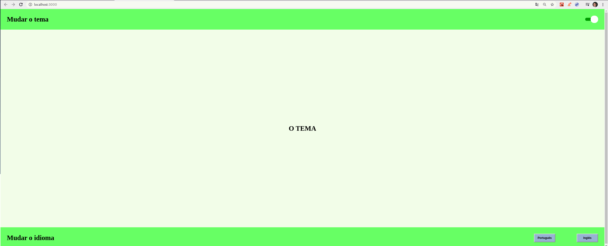
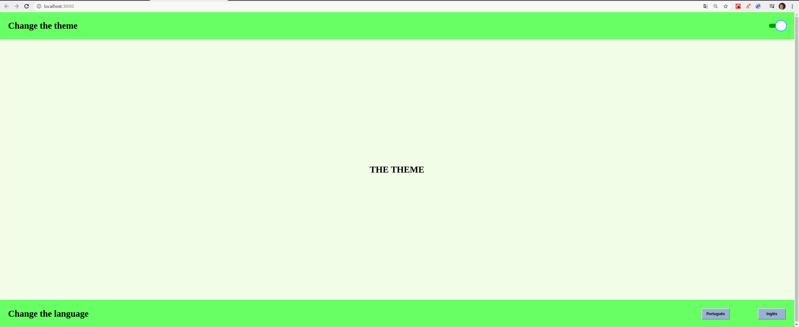
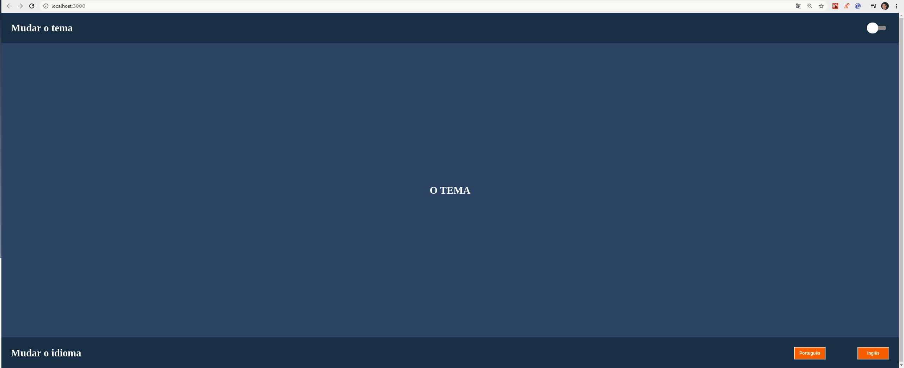
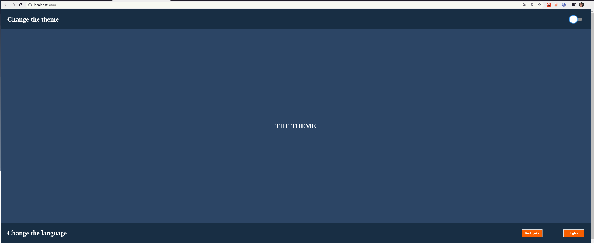

# Context API Estudo
## Aplicação criada para aprender React Context API.

### Aplicação bastante simples. Através do uso da API de contexto do React. Eu mudo o tema da aplicação. E também mudo o idioma entre Inglês e Português.

Tema Light em Português e Inglês.
    
    

Tema dark em POrtuguês e Inglês
    
    